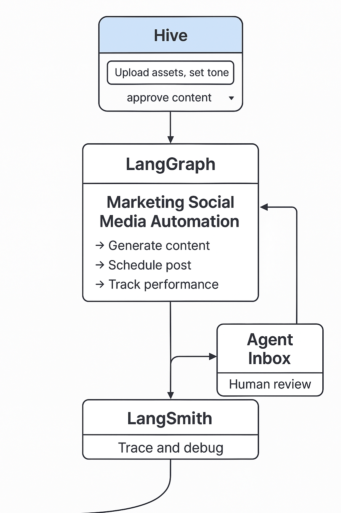

# Marketing Social Media AI Agent

This repository contains a FastAPI-based AI agent designed to assist with social media content generation and automation for marketing purposes. The system is modular and ready to integrate into a larger LangGraph and Agent Inbox-based Modular Control Platform (MCP).



---

## ✨ Features

- 📁 Upload marketing assets such as images and videos
- ✍️ Generate titles, captions, and hashtags using OpenAI's GPT model
- 🧠 Human-in-the-loop approval workflows (Agent Inbox integration planned)
- 🗓️ Schedule-ready content generation and optional performance analysis
- 🧩 Compatible with Hive interface as the primary frontend

---

## 🗂️ Folder Structure

```
marketing-ai-agent/
├── README.md
├── app/
│   ├── main.py         # FastAPI entry
│   ├── caption_agent.py
│   ├── vector_store.py
│   └── utils.py
├── static/
│   └── index.html
├── uploaded_docs/
├── uploaded_images/
├── requirements.txt
├── .env.example
└── figs/
    └── architecture.png
```

---

## 🚀 Getting Started

1. Clone the repository:

```bash
git clone https://github.com/yourname/marketing-ai-agent.git
cd marketing-ai-agent
```

2. Install dependencies:

```bash
pip install -r requirements.txt
```

3. Set up your `.env` file (use `.env.example` as reference)

4. Run the server:

```bash
uvicorn app.main:app --reload
```

Then open your browser to [http://localhost:8000](http://localhost:8000)

---

## 📡 API Endpoints

### POST `/upload-media`

Uploads media files (images/videos) for use in content generation.

### POST `/upload-text`

Uploads a .pdf or .docx file and indexes its content for retrieval.

### POST `/generate-captions`

Takes a user prompt and returns a suggested title, caption, and hashtags.

Request example:

```json
{
  "prompt": "Launching a smart AI toothbrush for kids"
}
```

Response example:

```json
{
  "generated": "Title: Smart Smiles for the Future\nCaption: Our new AI toothbrush makes dental care easy and fun.\nHashtags: #SmartSmile #KidsHealth #AIToothbrush"
}
```

---

## 🛠️ Future Enhancements

- Integrate LangGraph for agent flow management
- Connect to Agent Inbox for human decision checkpoints
- Enable content approval and revision workflows
- Visual logging through LangSmith Studio

---

## 📄 License

This project is open for internal use and collaboration. Please contact the repository owner for more details.

---

Developed by Lucy Hwang for the Nimbyx Marketing AI initiative.
